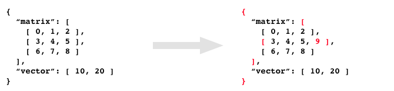
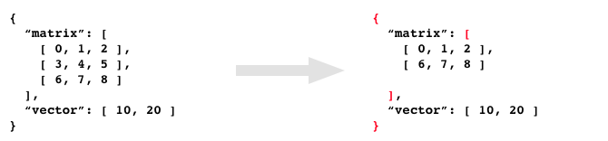
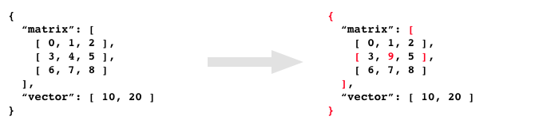
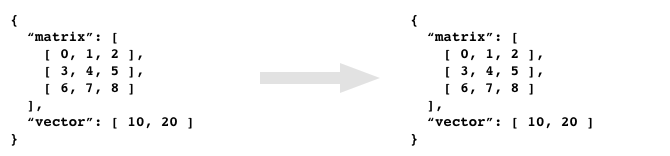

# json-touch-patch
[](https://travis-ci.org/mohayonao/json-touch-patch)
[](https://www.npmjs.org/package/json-touch-patch)
[](http://mohayonao.mit-license.org/)

> shallow copy JSON Patch [RFC 6902](https://tools.ietf.org/html/rfc6902)

## Features

- The original JSON is not update. The patches apply to a new JSON.
- The patches create a new object if it includes some changes into child elements.
- If error occurs, all patches are rejected. Return the original JSON.
- Maybe, these features are suitable to operate `store` in [React](https://facebook.github.io/react/) and [Redux](http://redux.js.org/) architecture.

## Installation

```
$ npm install --save json-touch-patch
```

## API

- `patch(prevObject: object, patches: object[], [ opts: object ]): object`
  - `opts.partial: boolean` not reject patches if error occurs (partial patching)
  - `opts.strict: boolean` throw an exception if error occurs
  - `opts.error: object` point to a cause patch if error occurs
  - returns `nextObject: object`

## Quick example

```js
const patch = require("json-touch-patch");

const prevObject = { "baz": "qux", "foo": "bar" };
const patches = [
  { "op": "replace", "path": "/baz", "value": "boo" },
];
const nextObject = patch(prevObject, patches);
// → { "baz": "boo", "foo": "bar" }
//              |
//             replaced

console.log(prevObject);
// → { "baz": "qux", "foo": "bar" }
//              |
//             not changed
```

## How to apply patches

### add

```js
const patches = [
  { op: "add", path: "/matrix/1/-", value: 9 },
];
```

Return a new JSON. It contains shallow-copied elements that have some changes into child elements. And it contains original elements that are not updated any.



```js
assert(prevObject.matrix[0] === nextObject.matrix[0]);
assert(prevObject.matrix[1] !== nextObject.matrix[1]);
assert(prevObject.matrix[2] === nextObject.matrix[2]);
```

### remove

```js
const patches = [
  { op: "remove", path: "/matrix/1" },
];
```

Return a new JSON. It contains shallow-copied elements that have some changes into child elements.



```js
assert(prevObject.matrix[0] === nextObject.matrix[0]);
assert(prevObject.matrix[1] !== nextObject.martix[1]);
assert(prevObject.matrix[2] === nextObject.matrix[1]);
```

### replace

```js
const patches = [
  { op: "replace", path: "/matrix/1/1", value: 9 },
];
```

Return a new JSON. It contains shallow-copied elements that have some changes into child elements. And it contains original elements that are not updated any.



```js
assert(prevObject.matrix[0] === nextObject.matrix[0]);
assert(prevObject.matrix[1] !== nextObject.matrix[1]);
assert(prevObject.matrix[2] === nextObject.matrix[2]);
```

### not replace

```js
const patches = [
  { op: "replace", path: "/matrix/1/1", value: 4 },
];
```

Return the original JSON. Because all elements are not changed.



`prevObject.matrix[1][1]` is already `4`. So, this patch is need not to update any.

```js
assert(prevObject === nextObject);
```

### test failed

```js
const patch = [
  { op: "add" , path: "/matrix/1/-", value: 9 },
  { op: "test", path: "/matrix/1/1", value: 0 },
];
```

Return the original JSON. Because a test op is failed. All patches are rejected.


`prevObject.matrix[1][1]` is not `0` but `4`. So, this test is failed.

```js
assert(prevObject === nextObject);
```

### invalid patch

```js
const json = [
  { op: "replace", path: "/matrix/1/100", value: 9 },
];
```

Return the original JSON. Because all patches are rejected when error occurs.


`prevObject.matrix[1][100]` is not defined. So, this patch is invalid.

```js
assert(prevObject === nextObject);
```

## License

MIT
