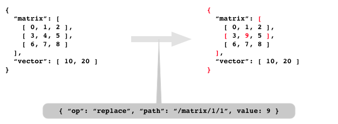

# json-touch-patch
[](https://travis-ci.org/mohayonao/json-touch-patch)
[](https://www.npmjs.org/package/json-touch-patch)
[](http://mohayonao.mit-license.org/)

> shallow immutable JSON Patch [RFC 6902](https://tools.ietf.org/html/rfc6902)

## Installation

```
npm install --save json-touch-patch
```

## API

- `patch(prevObject: object, patches: object[]): object`
  - returns `nextObject: object`

## Sallow and Immutable



```js
const assert = require("assert");
const patch = require("json-touch-patch");

const prevObject = {
  "matrix": [ [ 0, 1, 2 ], [ 3, 4, 5 ], [ 6, 7, 8 ] ],
  "vector": [ 10, 20 ]
};
const patches = [
  { "op": "replace", "path": "/matrix/1/1", value: 9 }
];
const nextObject = patch(prevObject, patches);
const expected = {
  "matrix": [ [ 0, 1, 2 ], [ 3, 9, 5 ], [ 6, 7, 8 ] ],
  "vector": [ 10, 20 ]
};

assert.deepEqual(nextObject, expected);
assert.notDeepEqual(prevObject, expected);

assert(prevObject !== nextObject);                           // changed
assert(prevObject.matrix !== nextObject.matrix);             // changed
assert(prevObject.matrix[0] === nextObject.matrix[0]);       // not changed
assert(prevObject.matrix[1] !== nextObject.matrix[1]);       // changed
assert(prevObject.matrix[1][0] === nextObject.matrix[1][0]); // not changed
assert(prevObject.matrix[1][1] !== nextObject.matrix[1][1]); // changed
assert(prevObject.matrix[1][2] === nextObject.matrix[1][2]); // not changed
assert(prevObject.matrix[2] === nextObject.matrix[2]);       // not changed
assert(prevObject.vector === nextObject.vector);             // not changed
```

## License

MIT
